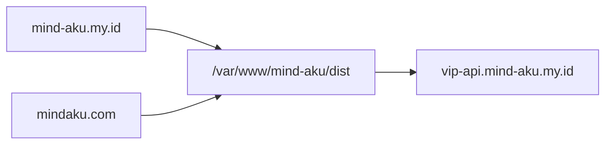

# Production deploy — Mind Aku portal

Dokumentasi deploy frontend portal ke Ubuntu (nginx, static build). Domain kanonik untuk marketing/link baru: **mindaku.com**. Domain lama **mind-aku.my.id** tetap **serve paralel** (dual-serve) agar password tersimpan di browser untuk origin lama tetap berfungsi.

## Ringkasan

| Item | Nilai |
|------|--------|
| Publik (kanonik) | https://mindaku.com |
| Domain lama (dual-serve) | https://mind-aku.my.id — SPA sama, **tanpa** 301 |
| Repo GitHub | https://github.com/mikbalvia/mind-aku.git |
| Server | Ubuntu VPS (SSH key auth; host details in private runbook) |
| Path aplikasi | `/var/www/mind-aku` |
| Artefak production | `/var/www/mind-aku/dist` (hasil `npm run build`) |
| Nginx vhost (kanonik) | `/etc/nginx/sites-available/mindaku.com` → `sites-enabled/` |
| Nginx vhost (legacy) | `/etc/nginx/sites-available/mind-aku.my.id` → `root` dist yang sama |
| TLS | Let's Encrypt: `mindaku.com` (+ www → apex); `mind-aku.my.id` punya cert sendiri |
| API OmniRoute | https://vip-api.mind-aku.my.id (tidak ikut migrasi domain portal) |
| DNS | Cloudflare → origin VPS |

Portal **hanya static files**; tidak ada proses Node yang berjalan di production. Variabel `VITE_*` di-inject saat **build**, bukan saat runtime.

## Arsitektur



Nginx di server yang sama juga melayani vhost lain (mis. `gateway-ai.mind-aku.my.id`, `vip-api.mind-aku.my.id`, `api-gateway.mind-aku.my.id`, dll.). Deploy portal menyentuh site `mindaku.com` dan `mind-aku.my.id` (root dist yang sama); tidak mengubah port atau config site API.

## Environment production (build-time)

File `/var/www/mind-aku/.env` (tidak di-commit; `chmod 600`):

```env
VITE_OMNIROUTE_BASE_URL=https://vip-api.mind-aku.my.id
VITE_AI_BASE_URL=https://vip-api.mind-aku.my.id/v1
VITE_PUBLIC_WEB_URL=https://mindaku.com
VITE_WHATSAPP_NUMBER=6281990609939
VITE_WHATSAPP_MESSAGE=Hai admin Mikbalvia Digital, saya ingin bertanya tentang layanan Mind Aku.
# Announcement-only group invite (hide join UI if empty)
# VITE_WHATSAPP_GROUP_URL=https://chat.whatsapp.com/XXXX
# Optional promo teaser — change CAMPAIGN_ID to re-prompt join modal
# VITE_COMMUNITY_CAMPAIGN_ID=aug2026-free-starter
# VITE_COMMUNITY_CAMPAIGN_TEASER=Free starter API key — klaim via chat admin
# VITE_COMMUNITY_CAMPAIGN_ENDS_AT=2026-08-31T23:59:59+07:00
```

Setelah mengubah `.env`, wajib **`npm run build`** ulang agar perubahan terbawa ke `dist/`.

OmniRoute payment defaults (server `/opt/omniroute-vip/shared/.env`):

```env
PAYMENT_SUCCESS_RETURN_URL=https://mindaku.com/payments/success
PAYMENT_CANCEL_RETURN_URL=https://mindaku.com/payments/cancel
```

## CORS (OmniRoute)

Browser memanggil API dari origin `https://mindaku.com`. Di OmniRoute env:

```bash
CORS_ALLOWED_ORIGINS="https://mindaku.com,https://www.mindaku.com,https://mind-aku.my.id"
```

Setelah masa transisi panjang, `mind-aku.my.id` boleh dihapus dari daftar jika domain lama dinonaktifkan. Runtime saat ini juga mengembalikan `Access-Control-Allow-Origin: *` pada beberapa endpoint — tetap set daftar eksplisit di env agar konfigurasi terdokumentasi.

## Prasyarat di server

- **Nginx** (sudah ada, shared dengan service lain)
- **Git**
- **Node 20** untuk user deploy via **nvm** (`~/.nvm`), hanya dipakai saat build — tidak membuka port dev 5173

Memuat nvm di shell non-interaktif:

```bash
export NVM_DIR="$HOME/.nvm"
[ -s "$NVM_DIR/nvm.sh" ] && . "$NVM_DIR/nvm.sh"
nvm use 20
```

## Deploy awal / domain baru (referensi)

```bash
sudo mkdir -p /var/www/mind-aku
sudo chown ubuntu:ubuntu /var/www/mind-aku
cd /var/www/mind-aku
git clone https://github.com/mikbalvia/mind-aku.git .
# buat .env (lihat di atas)
chmod 600 .env
npm install
npm run build
test -f dist/index.html
```

Nginx portal (`mindaku.com`):

- `server_name mindaku.com`; `www.mindaku.com` → `301 https://mindaku.com$request_uri`
- `root /var/www/mind-aku/dist`
- `location / { try_files $uri $uri/ /index.html; }`
- `/.well-known/acme-challenge/` → `root /var/www/html`

```bash
sudo ln -sf /etc/nginx/sites-available/mindaku.com /etc/nginx/sites-enabled/
sudo nginx -t && sudo systemctl reload nginx
sudo certbot --nginx -d mindaku.com -d www.mindaku.com --non-interactive --agree-tos --register-unsafely-without-email --redirect
```

Legacy dual-serve (`mind-aku.my.id`): same `root /var/www/mind-aku/dist` + SPA `try_files` + cert Let's Encrypt `mind-aku.my.id` (bukan redirect).

## Deploy ulang (update kode)

```bash
cd /var/www/mind-aku
git pull
export NVM_DIR="$HOME/.nvm" && . "$NVM_DIR/nvm.sh"
npm install
npm run build
```

Reload nginx **tidak** diperlukan selama `root` tetap menunjuk ke `dist/` yang sama.

## Auto-setup Claude Code / Codex

After login, the dashboard shows copy-paste commands. Public endpoint on the API host (script prompts for the API key — do **not** put the key in the URL):

```bash
curl -fsSL "https://vip-api.mind-aku.my.id/setup" | bash
```

```powershell
irm "https://vip-api.mind-aku.my.id/setup" | iex
```

OmniRoute env (optional): `SETUP_PUBLIC_BASE_URL=https://vip-api.mind-aku.my.id` so scripts embed the correct origin behind nginx.

## Security headers (portal nginx)

Add inside the `server { ... }` block for `mindaku.com` (HTTPS), then `sudo nginx -t && sudo systemctl reload nginx`.

**Important:** hashed JS/CSS may use long `immutable` cache. `index.html` (SPA shell) must use **`no-store`** — otherwise browsers/CDN keep an old HTML that points at an old JS hash after deploy.

```nginx
# server-level defaults (also repeated inside locations that set add_header)
add_header Content-Security-Policy "default-src 'self'; base-uri 'self'; object-src 'none'; frame-ancestors 'none'; form-action 'self'; script-src 'self' https://static.cloudflareinsights.com; style-src 'self' 'unsafe-inline' https://fonts.googleapis.com; font-src 'self' https://fonts.gstatic.com data:; img-src 'self' data: blob: https:; connect-src 'self' https://vip-api.mind-aku.my.id https:; worker-src 'self' blob:; manifest-src 'self'" always;
add_header X-Frame-Options "DENY" always;
add_header X-Content-Type-Options "nosniff" always;
add_header Referrer-Policy "strict-origin-when-cross-origin" always;
add_header Permissions-Policy "camera=(), microphone=(), geolocation=(), payment=(), usb=(), serial=()" always;
add_header Strict-Transport-Security "max-age=63072000; includeSubDomains; preload" always;

location / {
    try_files $uri $uri/ /index.html;
    etag off;
    add_header Cache-Control "no-store, no-cache, must-revalidate, max-age=0" always;
    add_header Pragma "no-cache" always;
    add_header Expires "0" always;
    # nginx: add_header in a location does not inherit server-level add_header — repeat:
    add_header Content-Security-Policy "default-src 'self'; base-uri 'self'; object-src 'none'; frame-ancestors 'none'; form-action 'self'; script-src 'self' https://static.cloudflareinsights.com; style-src 'self' 'unsafe-inline' https://fonts.googleapis.com; font-src 'self' https://fonts.gstatic.com data:; img-src 'self' data: blob: https:; connect-src 'self' https://vip-api.mind-aku.my.id https:; worker-src 'self' blob:; manifest-src 'self'" always;
    add_header X-Frame-Options "DENY" always;
    add_header X-Content-Type-Options "nosniff" always;
    add_header Referrer-Policy "strict-origin-when-cross-origin" always;
    add_header Permissions-Policy "camera=(), microphone=(), geolocation=(), payment=(), usb=(), serial=()" always;
    add_header Strict-Transport-Security "max-age=63072000; includeSubDomains; preload" always;
}

location ~* \.(js|mjs|css|png|jpg|jpeg|gif|ico|svg|woff2?)$ {
    expires 7d;
    add_header Cache-Control "public, immutable" always;
    # repeat security headers here too
}
```

The portal also auto-reloads when it detects a newer build id after deploy (`src/lib/forceFreshBuild.ts`).

Verify: `curl -sI https://mindaku.com | grep -iE 'cache-control|pragma|etag|content-security|strict-transport'`.

## Verifikasi

Di server:

```bash
curl -sI http://127.0.0.1 -H 'Host: mindaku.com' | head -5
curl -sI --resolve mind-aku.my.id:443:127.0.0.1 https://mind-aku.my.id/login | head -5
ls -la /var/www/mind-aku/dist/index.html
sudo nginx -t
```

Dari luar:

```bash
curl -sI https://mindaku.com
curl -sI https://mind-aku.my.id/login   # expect 200 (dual-serve), bukan 301
curl -sI -H 'Origin: https://mindaku.com' https://vip-api.mind-aku.my.id/api/v1/me/status
curl -sI -H 'Origin: https://mind-aku.my.id' https://vip-api.mind-aku.my.id/api/v1/me/status
```

Harapan: kedua domain portal HTTP 200 dengan SPA yang sama; API boleh 401/404 tanpa API key, tetapi response CORS menyertakan `access-control-allow-origin`.

Di browser: buka https://mindaku.com atau https://mind-aku.my.id → login dengan API key → Models / Usage / Logs. Password tersimpan per-origin: user yang pernah save di domain lama tetap buka `mind-aku.my.id`.

## Keamanan & operasi

- Akses server: gunakan **SSH key**, bukan password di chat atau repo.
- Jangan commit `.env` production (sudah di `.gitignore`).
- `package-lock.json`: jika `npm ci` gagal karena lock tidak sinkron, perbaiki lock di repo lokal lalu `git push`, atau sementara pakai `npm install` di server (seperti deploy awal).
- Perpanjangan TLS: Certbot timer systemd (standar Ubuntu).

## Yang tidak termasuk deploy portal

- Menjalankan atau mengonfigurasi proses OmniRoute (port backend, env payment, webhook SumoPod, dll.) kecuali payment return URL yang sudah diganti ke mindaku.com
- Mengubah vhost nginx API (`vip-api`, gateway, dll.)
- Pembukaan firewall port baru (hanya 80/443 nginx yang dipakai)

Payment & webhook: lihat [sumopod-payment-gateway.md](./sumopod-payment-gateway.md).
