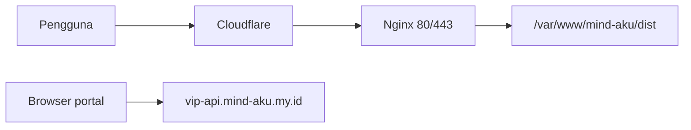

# Production deploy — Mind Aku portal

Dokumentasi deploy frontend portal ke Ubuntu (nginx, static build). Terakhir diperbarui setelah deploy awal ke **mind-aku.my.id**.

## Ringkasan

| Item | Nilai |
|------|--------|
| Publik | https://mind-aku.my.id |
| Repo GitHub | https://github.com/mikbalvia/mind-aku.git |
| Server | Ubuntu, `43.129.52.189` (SSH user: `ubuntu`) |
| Path aplikasi | `/var/www/mind-aku` |
| Artefak production | `/var/www/mind-aku/dist` (hasil `npm run build`) |
| Nginx vhost | `/etc/nginx/sites-available/mind-aku.my.id` → `sites-enabled/` |
| TLS origin | Let's Encrypt (`certbot`), cert: `/etc/letsencrypt/live/mind-aku.my.id/` |
| API OmniRoute | https://vip-api.mind-aku.my.id (proxy nginx → backend lokal, bukan bagian deploy portal) |
| DNS | Cloudflare → IP server |

Portal **hanya static files**; tidak ada proses Node yang berjalan di production. Variabel `VITE_*` di-inject saat **build**, bukan saat runtime.

## Arsitektur



Nginx di server yang sama juga melayani vhost lain (mis. `gateway-ai.mind-aku.my.id`, `vip-api.mind-aku.my.id`, `api-gateway.mind-aku.my.id`, dll.). Deploy portal **hanya menambah** site `mind-aku.my.id`; tidak mengubah port atau config site lain.

## Environment production (build-time)

File `/var/www/mind-aku/.env` (tidak di-commit; `chmod 600`):

```env
VITE_OMNIROUTE_BASE_URL=https://vip-api.mind-aku.my.id
VITE_AI_BASE_URL=https://vip-api.mind-aku.my.id/v1
VITE_PUBLIC_WEB_URL=https://mind-aku.my.id
VITE_WHATSAPP_NUMBER=6281990609939
VITE_WHATSAPP_MESSAGE=Hai admin Mikbalvia Digital, saya ingin bertanya tentang layanan Mind Aku.
```

Setelah mengubah `.env`, wajib **`npm run build`** ulang agar perubahan terbawa ke `dist/`.

## CORS (OmniRoute)

Browser memanggil API dari origin `https://mind-aku.my.id`. Di OmniRoute (env atau dashboard):

```bash
CORS_ALLOWED_ORIGINS="https://mind-aku.my.id"
```

Pada deploy awal, API sudah mengembalikan header `access-control-allow-origin: https://mind-aku.my.id` untuk preflight/request dari portal.

## Prasyarat di server

- **Nginx** (sudah ada, shared dengan service lain)
- **Git**
- **Node 20** untuk user deploy via **nvm** (`~/.nvm`), hanya dipakai saat build — tidak membuka port dev 5173

Memuat nvm di shell non-interaktif:

```bash
export NVM_DIR="$HOME/.nvm"
[ -s "$NVM_DIR/nvm.sh" ] && . "$NVM_DIR/nvm.sh"
nvm use 20
```

## Deploy awal (referensi)

Langkah yang sudah dilakukan; berguna jika rebuild di server baru.

```bash
sudo mkdir -p /var/www/mind-aku
sudo chown ubuntu:ubuntu /var/www/mind-aku
cd /var/www/mind-aku
git clone https://github.com/mikbalvia/mind-aku.git .
# buat .env (lihat di atas)
chmod 600 .env
npm install   # atau npm ci jika lock file sinkron
npm run build
test -f dist/index.html
```

Nginx (ringkas — Certbot kemudian menambahkan blok `listen 443 ssl`):

- `server_name mind-aku.my.id` (dan opsional `www` jika DNS ada)
- `root /var/www/mind-aku/dist`
- `location / { try_files $uri $uri/ /index.html; }`
- `/.well-known/acme-challenge/` → `root /var/www/html` (untuk Let's Encrypt)

```bash
sudo ln -sf /etc/nginx/sites-available/mind-aku.my.id /etc/nginx/sites-enabled/
sudo nginx -t && sudo systemctl reload nginx
sudo certbot --nginx -d mind-aku.my.id --non-interactive --agree-tos --register-unsafely-without-email --redirect
```

**Catatan `www`:** `www.mind-aku.my.id` belum punya record DNS saat certbot pertama; sertifikat hanya untuk `mind-aku.my.id`. Jika nanti menambah DNS `www`, jalankan certbot lagi dengan `-d www.mind-aku.my.id` atau perbarui `server_name` sesuai kebutuhan.

## Deploy ulang (update kode)

```bash
cd /var/www/mind-aku
git pull
export NVM_DIR="$HOME/.nvm" && . "$NVM_DIR/nvm.sh"
npm install
npm run build
```

Reload nginx **tidak** diperlukan selama `root` tetap menunjuk ke `dist/` yang sama.

## Auto-setup Claude Code / Codex

After login, the dashboard shows copy-paste commands. Public endpoint on the API host:

```bash
curl -fsSL "https://vip-api.mind-aku.my.id/setup?token=<API_KEY>" | bash
```

```powershell
irm "https://vip-api.mind-aku.my.id/setup?token=<API_KEY>" | iex
```

OmniRoute env (optional): `SETUP_PUBLIC_BASE_URL=https://vip-api.mind-aku.my.id` so scripts embed the correct origin behind nginx.

## Verifikasi

Di server:

```bash
curl -sI http://127.0.0.1 -H 'Host: mind-aku.my.id' | head -5
ls -la /var/www/mind-aku/dist/index.html
sudo nginx -t
```

Dari luar:

```bash
curl -sI https://mind-aku.my.id
curl -sI -H 'Origin: https://mind-aku.my.id' https://vip-api.mind-aku.my.id/api/v1/me/status
```

Harapan: portal HTTP 200; API boleh 401 tanpa API key, tetapi response CORS harus menyertakan `access-control-allow-origin: https://mind-aku.my.id`.

Di browser: buka https://mind-aku.my.id → login dengan API key → Models / Usage / Logs.

## Keamanan & operasi

- Akses server: gunakan **SSH key**, bukan password di chat atau repo.
- Jangan commit `.env` production (sudah di `.gitignore`).
- `package-lock.json`: jika `npm ci` gagal karena lock tidak sinkron, perbaiki lock di repo lokal lalu `git push`, atau sementara pakai `npm install` di server (seperti deploy awal).
- Perpanjangan TLS: Certbot timer systemd (standar Ubuntu).

## Yang tidak termasuk deploy portal

- Menjalankan atau mengonfigurasi proses OmniRoute (port backend, env payment, webhook SumoPod, dll.)
- Mengubah vhost nginx selain `mind-aku.my.id`
- Pembukaan firewall port baru (hanya 80/443 nginx yang dipakai)

Payment & webhook: lihat [sumopod-payment-gateway.md](./sumopod-payment-gateway.md).
